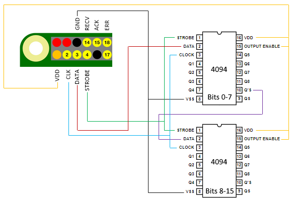

# ADILOK for Raspberry PI

## Introduction

This software receives train running messages from the open data provided
by [Traffic Management Finland](https://rata.digitraffic.fi)
[(CC BY 4.0)](http://creativecommons.org/licenses/by/4.0/). There is a bit
register which the received messages modify as defined in the message
rules. The contents of the bit register is send to shift-and-store circuits
such as 4094. These ICs can control LEDs, relays etc.

## Schematic Diagram



There can be any reasonable number of the shift-and-store registers.

`RECV` will blink always when a message is received. `ACK` will blink when
a message which causes an action to be taken is received.

`ERR` is set before the first message is received or the previous message
has been received over a minute ago. In this case, the socket will be
reconnected.

## Configuration

Configuration is a JSON file.

```json
{
  "bits": 8,
  "initialPattern": "00000000",
  "rules": [{
      "station": "HKI",
      "action": "PULSE",
      "type": "OCCUPY",
      "bit": 0
    }
  ]
}
```

* `bits` (mandatory) number of the controlled bits
* `initialPattern` the state of the bits when the program is started, must be `0` or `1` - if missing or too short, zero will be used
* `rules` see the definition in below


### Rules

There can be any number of rules. Each rule must contain at least `station`,
`bit`, and `action`. See all the possible rules in the list below.

* `station` (mandatory) station code
* `bit` (mandatory) bit number
* `action` (mandatory) action to do, see the list below
* `type` OCCUPY or RELEASE
* `trackSection` track section code
* `from` previous station code
* `fromSection` previous track section code
* `to` next station code
* `toSection` next track section code


#### Actions
* `AUTO` OCCUPY message sets the bit, RELEASE clears
* `AUTOINV` same as `AUTO` but inverted output
* `SET`
* `CLEAR`
* `PULSE` gives a positive pulse, length ~100 ms
* `TOGGLE` changes the current state to the opposite

## Installation

Make sure that you have a recent version of Node installed:

```
curl -sL https://deb.nodesource.com/setup_8.x | sudo -E bash -
sudo apt-get install nodejs
```

Clone the repository:

```
git clone https://github.com/ttsirkia/adilok-raspberry.git
```

Move to the correct directory and install the required libraries:

```
npm install
```

Modify the configuration file and start the program:

```
node adilok-raspberry.js
```

The configuration file is by default read from the current directory. However, you can give any other config file as an optional parameter.

## Debugging

Use the command line parameter `--debug` to start the program in debug mode.
It allows to set and clear bits by giving the corresponding bit number.

## License

**Do not use this software for any safety-critical purposes!**

This software is licensed under the MIT license.
